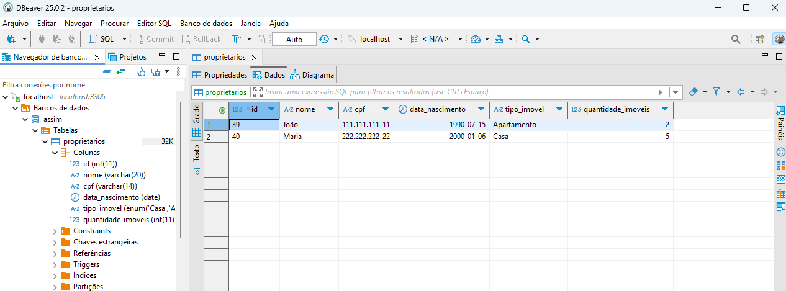

<h1 align="center"> Sistema de Cadastro de Proprietários </h1>

 Página Principal
  

 Resposta do Cadastro
  

 Listagem dos Proprietários
  

 Banco de Dados MySQL
  

## 🚀 Tecnologias

Esse projeto foi desenvolvido com as seguintes tecnologias:

- HTML5 e CSS3 - Estrutura e Estilização
- PHP - Backend
- MySQL - Banco de dados
- DBeaver / Xampp - Ferramentas de gerenciamento de banco de dados e servidor local.

## 💻 Projeto

Este projeto é um sistema simples de cadastro e listagem de proprietários de imóveis, desenvolvido com foco no aprendizado de PHP e MySQL. A aplicação permite adicionar novos proprietários e visualizar uma lista com os dados cadastrados de forma organizada.
